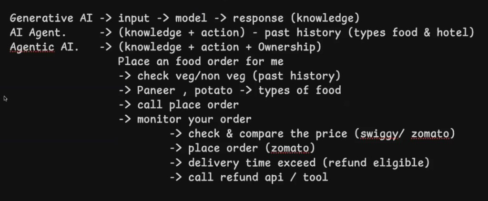
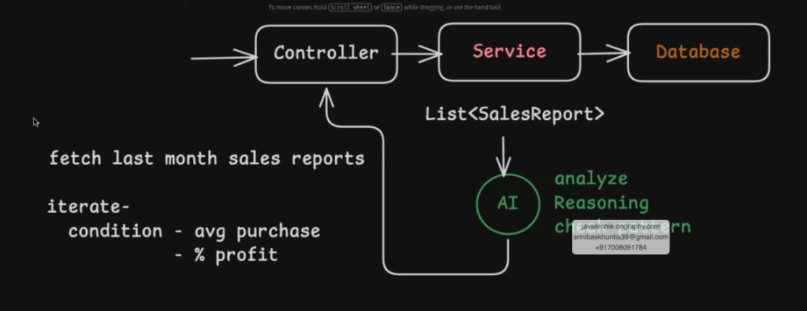
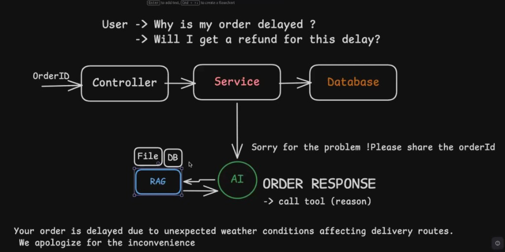
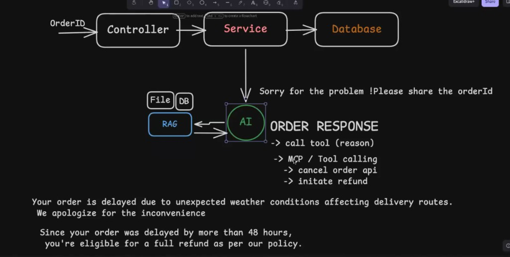
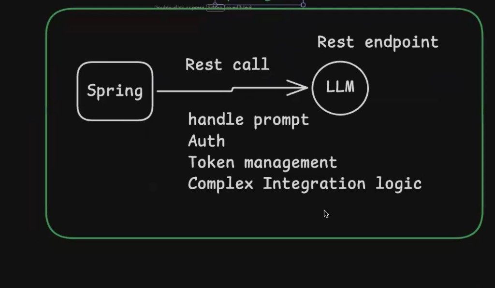
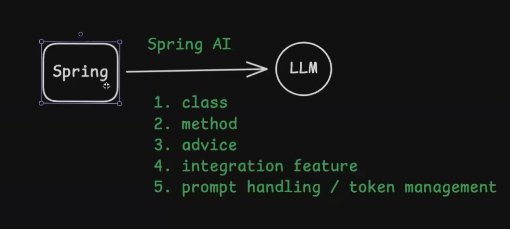

# Foundations

## 1. Generative AI vs AI Agent vs Agentic AI

### Examples of Agentic AI --> Cursor, GitHub Copilot

## 2. Get Summary of Sales Report using AI vs Using Logic

## 3. RAG (Retrieval Augmented Generation)

## 4. Tool Calling / MCP

## 5. Spring to LLM via REST Call

## 6. Spring AI

