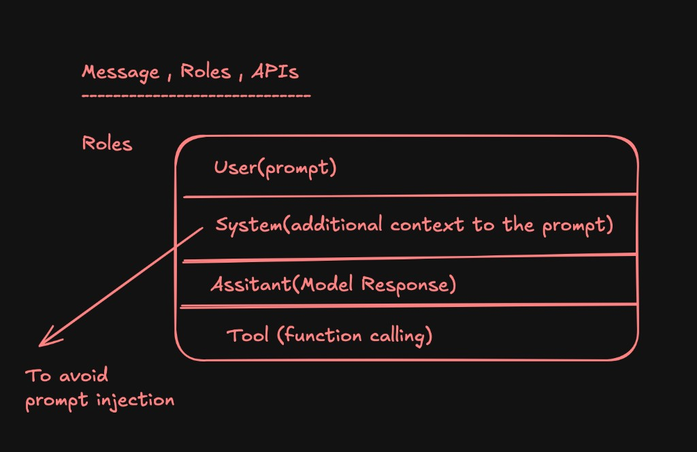

# Message, Roles, APIs

## Roles

- **User (prompt):** Input provided by the end user.
- **System (additional context to the prompt):** Instructions or context that guide model behavior — used to avoid prompt injection.
- **Assistant (model response):** Output generated by the AI model.
- **Tool (function calling):** Output or interaction related to function calling or external tool usage.
